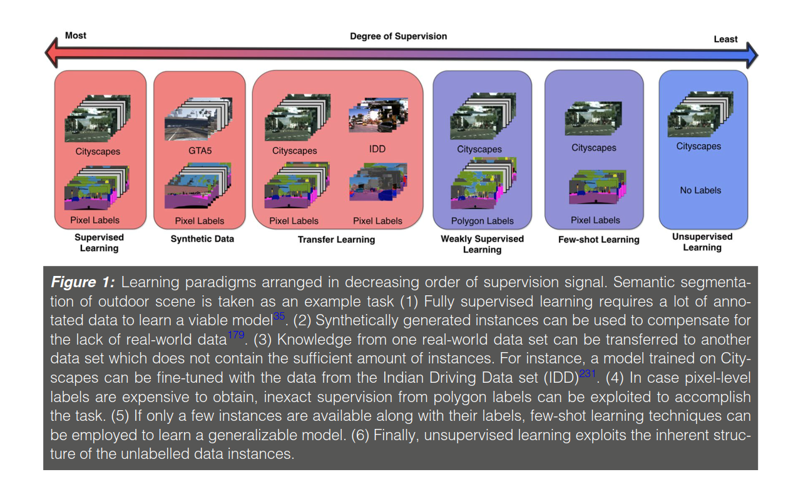
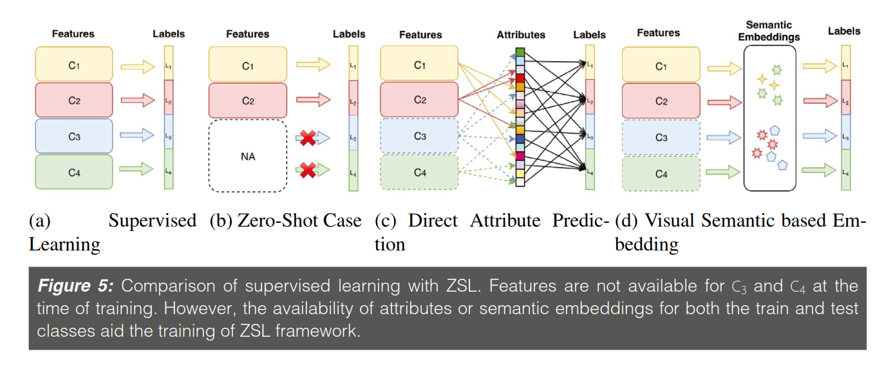

​                          

## About

这篇论文（[链接](https://link.springer.com/article/10.1007/s41745-019-0099-3)）是印度的几位教授写的，以计算机视觉的角度来阐述目前在全监督学习和无监督学习之间的几种训练方式，写得比较简略，但是适合我这种刚入门连名词都不是很清楚的人，可以让我用来梳理整个领域的技术发展脉络和现状。同时该论文也给出了大量的参考文献，也方便进行下一步的研究。实际上，严格地说，这篇文章不能算一篇合格的综述，只能说是那种“扫盲”的阅读材料。

出现上述技术发展的主要原因是数据集比较庞大，但是完全被标注好的数据却很少，而训练好的网络在面对现实多变的复杂场景时依然会出现问题，因此这两者之间出现了合成数据（synthetic data)，迁移学习(transfer learning)，弱监督学习(weakly supervised learning)，少量学习（Few-shot learning/K-shot learning)以及自监督学习(self-supervised learning)，边界当然就是无监督学习了(unsupervised learning)。其中需要注意，self-supervised learning和unsupervised learning不是一回事，前者仍然是有监督学习的一种，正如[Quora](https://www.quora.com/What-is-the-difference-between-self-supervised-and-unsupervised-learning)中的回答：

>Self-supervised, imposes classification by itself, derivative from the input data.
>
>Unsupervised, does not. At all.
>
>Meaning, that self-supervised, STILL has a measurement of terms of right contra wrong, as in, terms of classification.
>
>Unsupervised, does not.

<!--more-->

- 而目前，self-supervised learning正是Yann lecun在2019的ISSCC上所说的最新“蛋糕”组成成分。

不过在阅读之前，首先解决一个问题是：**什么是machine learning中的“label”和“feature"?**

- 简短地说，**feature就是输入，label就是输出**。一个feature就是我们输入网络数据中的一列，比如说，我们要分类猫和鸟，我们输入特征可能包括颜色，大小，重量等，label就是输出的结果，就是图片的动物是猫还是鸟。

- Quora上的一个[回答](https://www.quora.com/What-distinguishes-a-feature-from-a-label-in-machine-learning)比较系统点，这里直接贴出来：

> Imagine how a toddler might learn to recognize things in the world. The parent, often sits with her and they read a picture book, with photos of animals. The parent teaches the toddler but pointing to the pictures and **labeling** them: *"this is a dog", "this is a cat", "this is a tree", "this is a house"*, …
>
> After she has learned enough examples, the toddler gets a grasp on what are the key features of a dog, vs these of a cat or of a house or of a tree. So when the toddler and her dad walk in the park, and the father points to a thing she has never seen before, and asks her "*what's that?*", she is capable of generalising her learning, and correctly answer "*it's a dog!*". What might have happened behind the scenes is that consciously or subconsciously, the toddler extracted and examined the **features** of the "thing" - four legs, fluffy white hair, sticking tounge, round black eyes, etc - which aligned nicely with her preception of a "dog", and did not match any of the other entity types she knows.
>
> **So labels were the ground truth categories provided explicitly by her father during learning. And features are what she inferred from these implicitly, and then extracted and examined at "run time" in the park**.
>
> Similarly, in supervised learning, the NN learns by examples: an experts gives it many training examples, each example explicitly labled with the ground truth answer. The NN tries to predict these labels by modifying the values of the parameters of the NN. When an input comes, different areas of the network becomes active (I.e receive high value), depending on the input. These represent the features of the specific input. The output of the network (e.g classification decision) is a function of which of the parameters are active.
>
> **So the labels are explicitly given by the trainer during the training, and the features is the configuration of the network - which is implicitly learned by the network, as guided by the labels**.
>
> It's these features that then define the output of the network for a given input in runtime.
> Want to learn more or see how these features are represented? See this great article: [Feature Visualization](https://distill.pub/2017/feature-visualization)

整个supervised learning到unsupervised learning的发展就是人工标注的工作量太大，因为“label”这个东西需要人去手工注解，而且越精细，越准确就使训练结果越好，但是同时也会带来不适应现实数据变化的问题，鲁棒性不好。另外一方面，未标注的数据，“粗糙”的原始数据却很多，同时也比较容易抓取，所以慢慢地会向unsupervised learning发展。

## Structure

该论文的整个写作框架如下：

- Abstract

- Introduction
  - Notations and Definitions
  - Success of Supervised Learning

- Effectiveness of Synthetic Data

- Domain Adaption and Transfer Learning

- Weakly Supervised Learning
  - Incomplete Supervision
  - Inexact Supervision
  - Inaccurate Supervision

- K-Shot Learning

- Self-Supervised Learning

- Conclusion and Discussion

从整体上看，文章按照监督强度来写的，然后介绍了一些方法出现的原因，同时提及了一些关键的技术，对于更深的探讨没有做进一步地表述，而是直接给出了参考文献。

论文的内容：First, we summarize the **relevant techniques that fall between the paradigm of supervised and unsupervised learning**. Second, we take autonomous navigation as a running example to explain and compare different models. Finally, we highlight some shortcomings of current methods and suggest future directions.

## Content

### Reason

- Supervised deep learning-based techniques **require a large amount of human-annotated training data** to learn an adequate model. It is not viable to do so for every domain and task. Particularly, for problems in health care and autonomous navigation, collecting an exhaustive data set is either very expensive or all but impossible. (训练数据集大)

- Even though supervised methods excel at learning from a large quantity of data, results show that they are particularly **poor in generalizing the learned knowledge to new task or domain**. This is because a majority of learning techniques assume that both the train and test data are sampled from the same distribution. (功能单一性太强)

- Two bottlenecks of fully supervised deep learning methods—(1) **lack of labeled data in a particular domain**; (2) **unavailability of direct supervision for a particular task in a given domain**. 

### Categories of Methods

1.Data-centric techniques which solve the problem by **generating a large amount of data similar** to the one present in the original data set. 

- Data-centric techniques include data augmentation which involves **tweaking the data samples with some pre-defined transformations to increase the overall size of the data set**.  Another method is to use techniques borrowed from computer graphics to **generate synthetic data** which is used along with the original data to train the model.

2.Algorithm-centric techniques which **tweak the learning method to harness the limited data efficiently through various techniques** like on-demand human intervention, exploiting the inherent structure of data, capitalizing on freely available data on the web or solving for an easier but related surrogate task.

- Algorithm-centric techniques try to **relax the need of perfectly labeled data by altering the model requirements to acquire supervision through inexact , inaccurate , and incomplete labels**. Another set of methods exploit the knowledge gained while **learning from a related domain or task** by efficiently transferring it to the test environment.

3.Hybrid techniques which combine ideas from both the data and algorithm-centric methods.

- Hybrid methods incorporate techniques which focus on improving the performance of the model at both the data and algorithm level. （比如自动驾驶中的城市道路场景理解任务中，先用合成数据进行训练，然后进行domain shift去适应真实的场景理解任务）

### Simple Math Definition

假设${\cal X}$和${\cal Y}$分别是输入和标签空间（也就是输出了），在一般的机器学习问题中，我们假设要从数据集中学习N个objects。我们从这些objects提取特征去训练模型，即$X = ({\cal x}_{1}, {\cal x}_{2}, \cdots, {\cal x}_{N})$,$P(X)$是$X$上的边缘概率（marginal probability）。在fully supervised learning中，通常假设有相对应的标签$Y = ({\cal y}_{1}, {\cal y}_{2}, \cdots, {\cal y}_{N})$。

学习算法就是在假设空间（hypothesis space）${\cal F}$中寻找函数$f: {\cal X} \rightarrow {\cal Y}$，同时在空间${\cal L}$定义了损失函数（loss function)​ $l: {\cal Y} \times {\cal Y} \rightarrow \mathbb {R}^{\geq 0}$来衡量函数的适用性。同时机器学习算法也会最小化误差函数（错误预测）$R$来提升函数的正确性：
$$
R = \frac{1}{N}\sum ^{N} _{n=0}l({\cal y}_{i}, f({\cal x}_{i}))
$$

对synthetic data来说，输入空间发生了变换，设为${\cal X}_{synth}$，标签空间不变，此外，由于输入特征空间个边缘概率分布都发生了变化，因此利用新的domain${\cal D}_{synth}=\lbrace {\cal X}_{synth}, P({\cal X}_{synth}) \rbrace$来代替原来的real domain${\cal D}=\lbrace {\cal X}, P({\cal X}) \rbrace$。因此，我们也不可能用之前的预测函数$f_{synth}: {\cal X}_{synth} \rightarrow {\cal Y}$ 来构建${\cal X}$到${\cal Y}$的映射。

迁移学习（transfer learning）就是用于解决domain adaptation(DA)问题的技术，其不仅可以用于不同domain之间，也可以用于不同的task之间。根据input feature space 在source and target input distribution的分布是否相同，即 ${\cal X}_{s}$是否等于${\cal X}_{t}$，DA可以分为homogeneous DA和heterogeneous DA（同质和异质），显然heterogeneous DA问题要更为复杂些。

通常情况下，训练时，supervised learning认为所有的feature sets ${\cal x}_{i}$会有相应的标签${\cal y}_{i}$与之对应，实际情况是，这些标签在实际场景中可能是 $ {\tt incomplete, inexact,  inaccurate}$的，因此可能就要在weakly supervised learning技术框架下训练，比如说针对那些在网络抓取的数据而言。针对incomplete的标签场景而言，定义feature set $X = ({\cal x}_{1}, {\cal x}_{2}, \cdots, {\cal x}_{l}, {\cal x}_{l+1}, \cdots, {\cal x}_{n})$，其中$X_{labeled} = ({\cal x}_{1}, {\cal x}_{2}, \cdots, {\cal x}_{l})$会有对应的标签$Y_{labeled} = ({\cal y}_{1}, {\cal y}_{2}, \cdots, {\cal y}_{l})$供其训练，但是$X_{unlabeled} = ({\cal x}_{l+1} \cdots, {\cal x}_{n})$就没有任何对应的标签了。此外，一些其他的weakly supervised模型包含一些有着多种标签的单个实例或者多个实例共享一个标签（multiple-instace single-label)。这个时候会对feature set中的${\cal x}_{i}$进行打包处理，即${\cal x}_{i,j}, j=1,2,\cdots, m$。

尽管上述技术框架对应着不同程度的supervision，但是都需要大量的实例instances $X$来训练模型。如果某些class没有足够的instances的话就会使得训练不理想，因此出现了Few-shot learning(少量学习)和Zero-shot learning(ZSL)。

如果没有了监督信号（supervision signal），可以利用instances的内在结构（inherent structure）去训练模型。假设$X$和$Y$分别是feature set和label set，此时$P(Y|X)$无法得出，也无法确立任务${\cal T} = \lbrace {\cal Y}, P(Y|X) \rbrace$，不过我们可以定义一个proxy task${\cal T}_{proxy} = \lbrace Z, P(Z|X)\rbrace$，label set$Z$可以自己从数据中提取。For computer vision problems, proxy tasks have been defined based on spatial and temporal alignment, color, and motion cues.

### Effectiveness of Synthetic Data（个人感觉还是与RL相关的）

supervised learning在很多方面都取得了成功，但是存在的问题是需要大量的标注数据进行训练，即使是训练好了，也难以适应现实环境。

随着计算机图形学的发展，synthetic data十分易得，而且提供了精确的ground truth，同时数据的可操作性可以让其模拟任何真实的环境场景，甚至是真实环境下难以发生的。

In the visual domain, synthetic data have been used mainly for two purposes: (1) evaluation of the generalizability of the model due to the large variability of synthetic test examples, and (2) aiding the training through data augmentation for tasks where it is difficult to obtain ground truth, e.g., optical flow or depth perception.(测试模型的普适性和增强训练过程)

此外，还有直接在真实图像中加入synthetic data，比如在KITTI数据集中加入车辆3D模型，以辅助模型训练。

 One drawback of using syntheticdata for training a model is that it gives rise to [“sim2real” ](https://www.lyrn.ai/2018/12/30/sim2real-using-simulation-to-train-real-life-grasping-robots/)domain gap. 这个sim2real是与RL相关的概念，我这里找了一个CMU的[PPT](http://www.andrew.cmu.edu/course/10-703/slides/Lecture_sim2realmaxentRL.pdf)，可以看下。Recently, a stream of works in domain randomization claims to generate synthetic data with sufficient variations, such that the **model views real data as just another variation of the synthetic data set.** 将真实的数据视为合成数据的一个变体。

One of the major challenges in using synthetic data for training is the domain gap between real and synthetic data sets. 而迁移学习它提供了一些解决办法。

### Domain Adaptation and Transfer Learning

A model trained on source domain does not perform well on a target domain with **different distribution.** Domain adaptation(DA) is a technique which addresses this issue by reusing the knowledge gained through the source domain for the target domain.

DA techniques根据三个不同的标准进行分类，这三个标准（criteria）是：

- distance between domains

- presence of supervision in the source and target domain

- type of domain divergences

Prevalent literature also classifies DA in supervised, semi-supervised, and unsupervised setting according to the presence of labels in source and target domain.

Earlier works categorized the domain adaptation problem into homogeneous and heterogeneous settings. 现在，随着深度学习的热度提高，DA开始引入DNN和GAN的思想。DA使用DNN 去learn representations invariant to the domain，Adversarial methods encompass a framework which consists of a label classifier trained adversarially to the domain classifier.

### Weakly Supervised Learning

Weakly supervised learning is an umbrella term covering the **predictive models which are trained under incomplete, inexact, or inaccurate labels**. Apart from saving annotation cost and time, weakly supervised methods have proven to be robust to change in the domain during testing.

####  Incomplete Supervision(标签不全)

Weakly supervised techniques pertaining incomplete labels make use of either semi-supervised or active learning methods. The conventional semi-supervised approaches include self-training, co-training,  and graph-based methods.

#### Inexact Supervision(标签注解程度，比如一幅图像的bounding box标注和pixel-level标注)

Apart from dealing with partially labeled data sets, weakly supervised techniques also help **relax the degree of annotation** needed to solve a structured prediction problem.

A popular approach to harness inexact labels is to formulate the problem in **multiple-instance learning (MIL) framework**. In MIL, the image is interpreted as a **bag of patches.** If one of the patches within the image contains the object of interest, the image is labeled as a positive instance, otherwise negative. Learning scheme alternates between estimating object appearance model and predicting the patches within positive image.

#### Inaccurate Supervision(策划大的数据集给模型训练成本昂贵，同时效果也不一定很好。如果采用从网站抓取数据的方式来给模型训练，可能比较实际，但是这些原始的数据集存在噪声，给训练算法提出了挑战。 "webly" supervised scenario)

Broadly, we categorize the techniques into two sets—the first approach resorts to **treating the noisy instances as outliers and discard them during training**. Another stream of methods focus on **building algorithms robust to noise** by devising noise-tolerant loss functions or adding appropriate regularization terms.

### K-Shot Learning(样本少-Few-shot learning和Zero-shot learning)

Few-shot learning techniques attempt to adapt the current machine learning methods to perform well under a scenario where only a few training instances are available per class. More recent efforts into a few-shot learning techniques can be broadly categorized into **metric-learning** and **meta-learning-based **methods.

- Metric-learning aims to design techniques for**embedding the input instances to a feature space** beneficial to few-shot settings. A common approach is to find a good similarity metric in the new feature space applicable to novel categories.

- Meta-learning entails a class of approaches which quickly adapt to a new task using only a few data instances and training iterations. To achieve this, the model is **trained on a set of tasks**, such that it transfers the “learning ability” to a novel task. In other words, **meta-learners treat the tasks as training examples**.

Another set of methods for few-shot learning relies on**efficient regularization techniques **to **avoid over-fitting** on the small number ofinstances.

Literature pertaining to Zero-Shot Learning (ZSL) focuses on finding the representation of a novel category without any instance. **Methods used to address ZSL are distinct from few-shot learning.** A major assumptiontaken in this setting is that** the classes observed by model during training are semantically related to the unseen classes encountered during testing.**This semantic relationship is often captured through class-attributes containing shape, color, pose, etc., of the object which are **either labeled by experts or obtained through knowledge sources **such as Wikipedia, Flickr, etc.

In ZSL, a joint embedding space is learned during training where **both the visual features and semantic vectors are projected**. During testing on unseen classes, **nearest-neighbor search** is performed in this embedding space to match the projection of visual feature vector against a novel object type.

### Self-supervised Learning(without any external supervision)

Explicit annotation pertaining to the main task is avoided by**defining an auxiliary task that provides a supervisory signal in self-supervised learning**. The assumption is that successful training of the model on the auxiliary task will inherently make it **learn semantic concepts such as object classes and boundaries**. This makes it possible to share knowledge between two tasks.

However, unlike transfer learning, it does not require a large amount of annotated data from another domain or task.

The existing literature pertaining self-supervision relies on **using the spatial and temporal context of an entity for “free” supervision signal.**

上图比较了supervised learning / weakly-supervised learning / self-supervised learning之间的区别，supervised learning需要bounding box作为label进行训练 ；weakly-supervised learning使用图像级别的标题，语义描述嵌入等进行神经网络预训练；self-supervised learning使用pretext task来学习物体的表示方法。

### Conclusion and Discussion

The space between fully supervised and unsupervised learning can be qualitatively divided on the basis of the degree of supervision needed to learn the model.

- While synthetic data are cost effective and flexible alternative to real-world data sets, the models learned using it still need to be adapted to the real-world setting. 

- Transfer learning techniques address this issue by explicitly aligning different domains through discrepancy-based or adversarial approaches. However, **both of these techniques require “strict” annotation pertaining to the task which hinders the generalization capability of the model. **

- Weakly supervised algorithms **relax the need of exact supervision by making the learning model tolerant of incomplete, inexact, and inaccurate supervision.** This helps the model to harness the huge amount of data available on the web. 

- Even when a particular domain contains an insufficient number of instances, methods in k-shot learning try to build a reasonable model using parameter regularization or meta-learning techniques.

- Finally, self-supervised techniques **completely eliminate the need of annotation as they define a proxy task for which annotation is implicit within the data instances.**

- Despite their success, recent models weigh heavily on deep neural networks for their performance. Hence they carry both the pros and cons of using these models; **cons being lack of interpretability and outcomes which largely depend on hyperparameters. **

