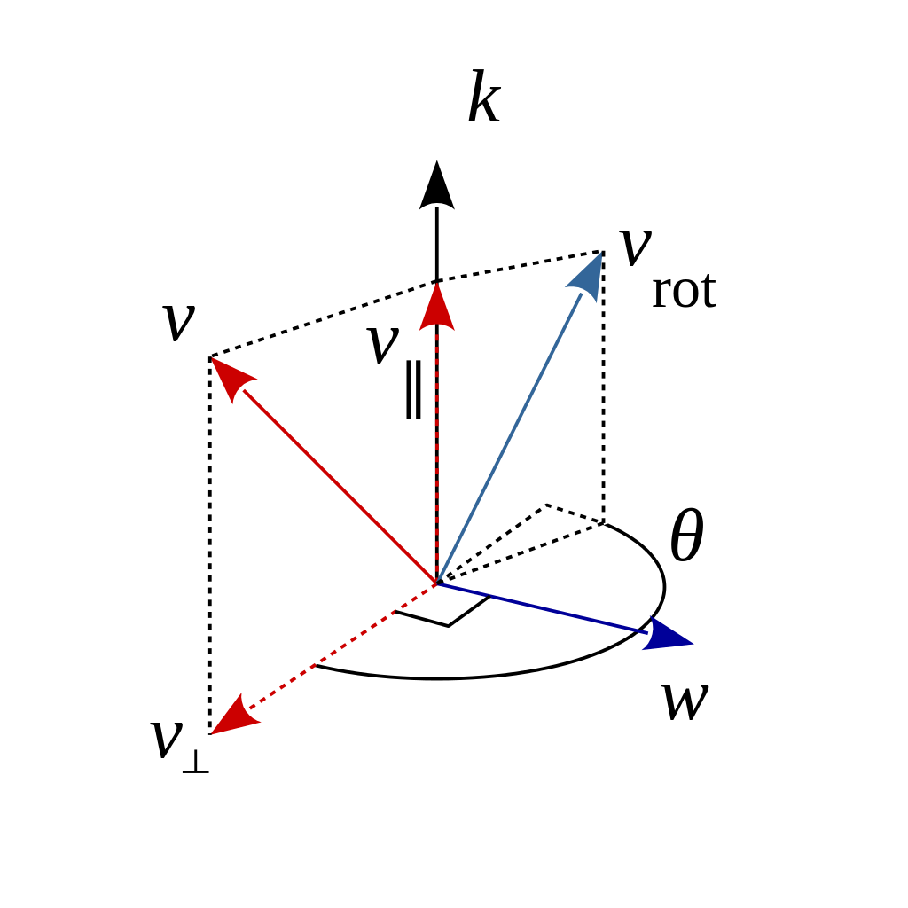
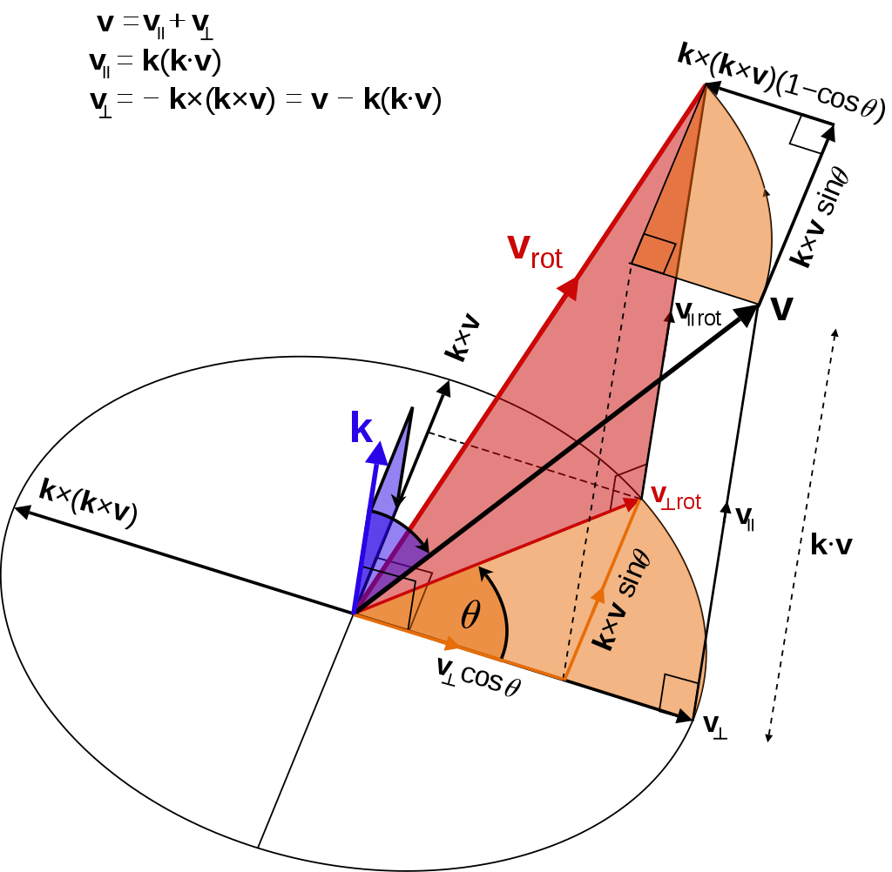

​         

本次课程主要研究**三维空间刚体运动**，即visual slam的运动方程中的$x_{k}$如何表达。


## 点与坐标系

在2D情况下，物体可以通过两个坐标和一个旋转角进行表达，即$(x,y,\theta)$。

 在3D情况下，物体是6自由度的，包括平移和旋转，每个都得用三个变量表达，可以认为3D情况是包含着3个2D的情况，旋转轴不同。                

<!--more-->

理清坐标系（参考系），点，向量，向量的坐标，运动变换之间的关系。相机会有相机坐标系，机器人会有机体坐标系（通常是运动的），空间会有世界坐标系（通常是固定的），这都是为了研究问题的方便，通过变换进行运动的表述。

熟悉向量的相关运算规则，比如，向量的加减法，向量的内积和外积。以及向量和矩阵的关系。
$$
\begin{align*}
& 内积： \bf{a} \cdot \bf{b} =\bf{a^{T}} \bf{b}=\sum_{i=1}^{n}=|\bf{a}||\bf{b}| \cos \left< \bf{a}, \bf{b}\right> \\

&外积： \bf{a} \times \bf{b}=
\begin{bmatrix}
\bf{i} & \bf{j} & \bf{k} \\
a_{1} & a_{2} & a_{3} \\
b_{1} & b_{2} & b_{3}
\end{bmatrix}
=
\begin{bmatrix}
a_{2}b_{3}-a_{3}b_{2}\\
a_{3}b_{1}-a_{1}b_{3}\\
a_{1}b_{2}-a_{2}b_{1}
\end{bmatrix}
=
\begin{bmatrix}
0 & -a_{3} & a_{2}\\
a_{3} & 0 & -a_{1} \\
-a_{2} & a_{1} & 0
\end{bmatrix}
\bf{b} \triangleq \bf{a} ^{\wedge} \bf{b}
\end{align*}
$$

建立了坐标系之后，如何表示同一个向量在不同坐标系之间的坐标，坐标系之间的变换关系又该如何描述。坐标系之间的变换可以分解成坐标系原点之间之间的平移和坐标轴之间的旋转，那么可以用一个平移向量和旋转矩阵来描述这样的变换。我们知道矩阵可以表述坐标系之间的变换，对于三维空间而言，可以用一个$4 \times 4$的矩阵来描述三维坐标系之间的变换，这也就是平移向量和旋转矩阵的合成矩阵，具体后面会细说。


## 旋转矩阵

一个向量在坐标系进行旋转后不变，因此可以通过此推导出旋转矩阵$R$的表达式（即用变换前后的坐标系的基向量进行表述）。
$$
\begin{bmatrix}
a_{1}\\
a_{2}\\
a_{3}
\end{bmatrix}
=
\begin{bmatrix}
e_{1}^{T}e_{1}^{'} & e_{1}^{T}e_{2}^{'} & e_{1}^{T}e_{3}^{'}\\
e_{2}^{T}e_{1}^{'} & e_{2}^{T}e_{2}^{'} & e_{2}^{T}e_{3}^{'}\\
e_{3}^{T}e_{1}^{'} & e_{3}^{T}e_{2}^{'} & e_{3}^{T}e_{3}^{'}
\end{bmatrix}
\begin{bmatrix}
a_{1}^{'}\\
a_{2}^{'}\\
a_{3}^{'}
\end{bmatrix}
\triangleq R {\bf a}^{'}
$$
旋转矩阵是正交矩阵（$RR^{T}=I$），且行列式为1（$\det (R)=1$）。旋转矩阵属于特殊正交群special orthogonal group，即：
$$
SO(n) = \lbrace R \in \mathbb{R}^{n \times n} | RR^{T}=I, \det(R)=1 \rbrace
$$
对一个旋转矩阵进行转置就描述了一个相反方向的旋转。


欧拉旋转定理（Euler’s rotation theorem）：刚体在三维空间里的一般运动，可分解为刚体上方某一点的平移，以及绕经过此点的旋转轴的转动。
$$
{\bf a^{'}}= R \bf{a} + \bf{t}
$$
 齐次形式（homogeneous）来更方便地表达变换，因为加上平移不满足线性性。定义变换矩阵$T$
$$
\begin{bmatrix}
a^{'}\\
1
\end{bmatrix}
=
\begin{bmatrix}
R & \bf{t}\\
\bf{ 0^{T} } & 1
\end{bmatrix}
\begin{bmatrix}
a \\
1
\end{bmatrix}
\triangleq T
\begin{bmatrix}
a\\
1
\end{bmatrix}
$$
齐次坐标认为其乘以任意非零常数时仍表达同一个坐标（归一化）。 变换矩阵的集合称为特殊欧式群special Euclidean Group:
$$
SE(3)=\lbrace T=
\begin{bmatrix}
R & \bf{t}\\
\bf{ 0^{T}} & 1
\end{bmatrix}
\in \mathbb{R}^{4 \times 4} |
R \in SO(3), \bf{t} \in \mathbb{R}^{3} \rbrace
$$

$$
T^{-1}=
\begin{bmatrix}
R^{T} & -R^{T}{\bf t}\\
{\bf 0^{T}} & 1
\end{bmatrix}
$$

定义了变化矩阵后，多次变换可以直接对变换矩阵直接相乘即可。


## 旋转向量与欧拉角

一般来说视觉SLAM有旋转矩阵和平移向量就够了，一般也是用这样的方式表达。为了进行拓展，比如在航迹推算和组合导航中，通常用四元数来表述物体姿态。

旋转矩阵有9个元素但仅表示三个自由度，比较冗余，因此引入旋转向量(rotation vector)，方向为旋转轴，长度为转过的角度，又称为角轴或轴角（angle axis）。

旋转向量只有三个量，无约束，更加直观，但是旋转轴一般不容易得知，其中旋转向量和旋转矩阵的关系可以通过罗德里格斯公式得出（Rodrigues' s Formula）：（假设旋转轴为$\bf{n}$，旋转角为$\theta$）
$$
\begin{align*}
& R = \cos \theta {\bf I}+(1-\cos \theta){\bf n} {\bf n^{T}}+\sin \theta {\bf n^{\wedge}}\\
& \theta = \arccos(\frac{tr(R)-1}{2}) \\
& R{\bf n}=\bf{n} \quad特征值为1的特征向量
\end{align*}
$$
欧拉角（Euler Angles）将旋转分解成三个方向上的转动，最常见的是Z-Y-X，即yaw-pitch-roll（偏航-俯仰-横滚），不同领域习惯不同。但是欧拉角会有万向锁问题（[gimbal lock](<https://krasjet.github.io/quaternion/bonus_gimbal_lock.pdf>))，会在特定值丢失一个自由度，存在奇异性问题，因此欧拉角不适合插值和迭代。实际上，仅用三个实数表达旋转时，会不可避免地存在奇异性问题。视觉SLAM中一般不用欧拉角表达姿态，主要在人机交互中用。


## 四元数（Quaternion）

2D情况下，可以用单位复数表达旋转，$z=x+iy=\rho e^{i \theta}$，乘$i$代表转转90度。

3D情况下，类似地，四元数可作为复数地扩充。

四元数有三个虚部和一个实部，${\bf q}=q_{0}+q_{1}i+q_{2}j+q_{3}k$，虚部之间满足关系（自己和自己运算像复数，自己和别人运算像叉乘）:
$$
\begin{cases}
i^{2}=j^{2}=k^{2}=-1 \\
ij=k,jk=-k \\
jk=i.kj=-i \\
ki=j,ik=-j
\end{cases}
$$
单位四元数可以表达旋转，${\bf q}=q_{0}+q_{1}i+q_{2}j+q_{3}k=[s, {\bf v}], s=q_{0}\in \mathbb{R}, {\bf v}=[q_{1}, q_{2}, q_{3}]^{T}\in \mathbb{R}^{3}$，四元数有以下地运算规则：
$$
{\bf q}_{a}+{\bf q}_{b}=[s_{a}\pm s_{b}, {\bf v}_{a}\pm {\bf v}_{b}]\\

\begin{align*}
{\bf q}_{a}{\bf q}_{b}= &s_{a}s_{b}-x_{a}x_{b}-y_{a}y_{b}-z_{a}z_{b}\\
& +(s_{a}x_{b}+x_{a}s_{b}+y_{a}z_{b}-z_{a}y_{b})i\\
& +(s_{a}y_{b}-x_{a}z_{b}+y_{a}s_{b}+z_{a}x_{b})j\\
& +(s_{a}z_{b}+x_{a}y_{b}-y_{b}x_{a}+z_{a}s_{b})k 
\end{align*}
\\
{\bf q}_{a}{\bf q}_{b}= [s_{a}s_{b}-{\bf v}_{a}^{T}{\bf v}_{b}, s_{a}{\bf v}_{b}+s_{b}{\bf v}_{a}+{\bf v}_{a} \times {\bf v}_{b}] \\

{\bf q}^{*}=s_{a}-x_{a}i-y_{a}j-z_{a}k=[s_{a}, -{\bf v}_{a}]\\

\left\| {\bf q}_{a} \right\|= \sqrt{s_{a}^{2}+x_{a}^{2}+y_{a}^{2}+z_{a}^{2}} \\

{\bf q}^{-1}={\bf q}^{*}/ \left\| {\bf q} \right\| ^{2}\\

k{\bf q}=[ks, k{\bf v}]\\

{\bf q}_{a} \cdot {\bf q}_{b}=s_{a}s_{b}+x_{a}x_{b}i+y_{a}y_{b}j+z_{a}z_{b}k
$$

四元数到角轴：${\bf q}=[\cos \frac{\theta}{2},n_{x}\sin \frac{\theta}{2}, n_{y}\sin \frac{\theta}{2}, n_{z}\sin \frac{\theta}{2}]^{T}$。

角轴到四元数：$\theta =2 \arccos q_{0}, [n_{x}, n_{y}, n_{z}]^{T} = [q_{1}, q_{2}, q_{3}]^{T}/  \sin \frac{\theta}{2}$

三维点$p(x,y,z)$经过一次以${\bf q}$表示的旋转后，得到了$p^{'}$，${\bf p}=[0,x,y,z]=[0, {\bf v}]$，旋转之后的关系为${\bf p}^{'}={\bf q} {\bf p} {\bf q}^{-1}$。四元数相比与角轴和欧拉角，形式上更加紧凑，也无奇异性。

**值得注意的是，${\bf q}$和$-{\bf q}$表示同一个旋转。**

----


学习四元数的一个最直观的问题就是为什么三个变量来描述三维旋转，诸如欧拉角会出现奇异性的情况，而用四个变量的四元数就不会？也就说用高维的东西描述低维的东西更加有效。

知乎上有相关的[回答](https://www.zhihu.com/question/20962240/answer/33438846)，写得还算不错，比较直观。不过依旧没有解决为什么三个变量描述三维旋转会出现奇异性的现象。


> 利用四元数来对三维点的旋转进行操作，是通过纯四元数来进行的，即变换后的点可以表示为${\bf qwq^{-1} }$，这里的问题是为什么这种形式。（注意，这里的四元数是单位四元数）

>汉密尔顿定义的性质：
>
>1.运算产生的结果也要是三维向量
>2.存在一个元运算，任何三维向量进行元运算的结果就是其本身
>3.对于任何一个运算，都存在一个逆运算，这两个运算的积是元运算
>4.运算满足结合律
>
>其实，四元数有四个变量，完全可以被看作一个四维向量。单位四元数（norm=1）则存在于四维空间的一个球面上。${\bf q}_{a} {\bf q}_{b}$，四元数${\bf q}_{a}$乘以四元数${\bf q}_{b}$其实看作（1）对${\bf q}_{a}$进行${\bf q}_{b}$左旋转，或者（2）对${\bf q}_{b}$进行${\bf q}_{a}$右旋转。所以从始至终，四元数定义的都是四维旋转，而不是三维旋转！任意的四维旋转都可以唯一的拆分为一个左旋转和一个右旋转，表达出来就是${\bf q}_{L}{\bf p}{\bf q}_{R}$。这里，我们对四元数（四维向量）${\bf p}$进行了一个${\bf q}_{L}$左旋转和一个${\bf q}_{R}$右旋转。结果当然是一个四元数，符合性质1。这个运算也同时符合性质2，3，4。
>
>为了进行三维旋转运算，汉密尔顿首先在四维空间里划出了一块三维空间。汉密尔顿定义了一种纯四元数（pure quaternion），其表达式为${\bf q}_{w}=(0,w_{x},w_{y},w_{z})$。纯四元数第一项为零，它存在于四维空间的三维超平面上，与三维空间中的三维向量一一对应。然后，就有了我们常见的${\bf q}  {\bf q}_{w} {\bf q}^{*}$这种左乘单位四元数，右乘其共轭的表达式。这个运算形式是为了限制其运算结果所在的空间。简单的说，当对一个三维向量进行三维旋转后，我们希望得到的是一个三维向量，而不是四维向量。
>
>这也就解释了为什么四元数对应于角轴的关系式中是$\frac{\theta}{2}$，而不是$\theta$，这是因为${\bf q}$做的就是一个$\frac{\theta}{2}$的旋转，而${\bf q}^{-1}$也做了一个$\frac{\theta }{2}$的旋转。我们进行了两次旋转，而不是一次，这两次旋转的结果是一个旋转角为$\theta$的旋转。

此外，还有一点是，四元数可以用2x2复数矩阵（特殊酉群）和4x4矩阵来描述，但是四元数之间不满足乘法交换律，即${\bf q}_{1} {\bf q}_{2} \ne {\bf q}_{2} {\bf q}_{1}$，但是二维平面里的复数相乘满足乘法交换律，这里我粗略地理解是，二维旋转只有角度，没有轴的概念，只有按照什么顺序旋转多少角度，因此先转$\theta$，再转$\alpha$，与先转$\alpha$，再转$\theta$的结果是一样的，但是四元数相乘不是，每次转都是有个旋转轴的，因此不可交换。


有关四元数，旋转，群的理解和证明，可以参考这篇[文章](https://krasjet.github.io/quaternion/quaternion.pdf)
$$
\begin {align*}
{\bf v}^{'} & = {\bf v}_{||}^{'} + {\bf v}_{\bot}^{'}={\bf v}_{||} + {\bf q} {\bf v}_{\bot}\\ 
            & = {\bf p} {\bf p}^{-1} {\bf v}_{\bot} + {\bf p} {\bf p} {\bf v}_{\bot}\\
            & = {\bf p} {\bf p}^{*} {\bf v}_{\bot} + {\bf p} {\bf p} {\bf v}_{\bot}\\
            & = {\bf p} {\bf v}_{||} {\bf p}^{*} + {\bf p} {\bf v}_{\bot} {\bf p}^{*}\\
            & = {\bf p} ({\bf v}_{||}+{\bf v}_{\bot}) {\bf p}^{*}\\
            & = {\bf p} {\bf v} {\bf p}^{*}\\
            & = {\bf v}_{||} + {\bf p}^{2} {\bf v}_{\bot}
\end{align*}
\\
{\bf q}=[\cos \theta, \sin \theta ({\bf u})], {\bf p}=[\cos \frac{\theta}{2}, \sin \frac{\theta}{2} ({\bf u})],{\bf q}={\bf p}^{2}
$$


**对于平行的分量，变换完全抵消，对于垂直的分量，施加两次变换，这也就是为什么是**$\frac {\theta}{2}$。


**四元数与群：**

单位四元数与 3D 旋转有一个**2对1满射同态关系**，或者说单位四元数**双倍覆盖了3D旋转**。因为这个映射是满射，我们可以说所有的单位四元数都对应着一个 3D 旋转。或者说，一个四维单位超球面（也叫做$\mathbb S^{3}$）上任意一点所对应的四元数（$∥q∥ = 1$）都对应着一个 3D 旋转。

四元数，旋转矩阵，群，geometric algebra都有着紧密的联系，因此可以先做好相关的功课，这里列出几篇阅读材料：

[Introduction to Lie Groups](<https://alistairsavage.ca/mat4144/notes/MAT4144-5158-LieGroups.pdf>)

[Geometric Algebra Primer](<http://www.jaapsuter.com/geometric-algebra.pdf>)

[youtube geometric algebra](<https://www.youtube.com/watch?reload=9&v=PNlgMPzj-7Q&list=PLpzmRsG7u_gqaTo_vEseQ7U8KFvtiJY4K>)


> **A Quaternion is a scalar plus a bivector.**
>
> Apart from the fact that quaternions have four components, there is nothing four-dimensional or imaginary about a quaternion. The first component is a scalar, and the other three components form the bivector-plane relative to which the rotation is performed.
>

这似乎解释了之前我的疑问，为什么要用四个变量来描述三维，就是用得用高维的解释低维的，这里指出了四元数拥有四个变量，但是不是指四维或者虚数，而是通过标量和bivector的组合来描述旋转，几何代数的这种形式统一了不同维度的旋转，因此比较优雅。不过更深层次的东西和理解涉及到比较多的数学知识和空间理解，我暂时还达不到。。。。

---

----

## 作业与实践


### 熟悉Eigen运算


对于线性方程组$Ax=b$，其中$A$是方阵。


1).什么条件下，$x$有解且唯一？

当矩阵$A$可逆的时候，也就是此时矩阵满秩。


2).高斯消元法原理

高斯消元法其实就是对系数矩阵作初等行变换，这不改变方程的解，将系数矩阵化成上三角矩阵的形式，然后从下往上依次解出方程组的每个分量解（回代）。如果是针对列主元的高斯消元法，需要加入方程组的右侧值，与系数矩阵组成增广矩阵，进而求解。


3). QR分解的原理

任意的$A \in {\bf C}^{n \times n}$都可以进行$QR$分解，即$A=QR$，$Q$为n阶酉矩阵($QQ^
{H}=I$)，$R$为n阶上三角矩阵。

$QR$分解与Gram-Schmidt正交化有关，即将$A$进行Gram-Schmidt正交化，化为$Q$，然后求出R。Q的列向量是A的列空间的标准正交基，R是一个非奇异可逆的上三角矩阵，即将矩阵每个列作为一个基本单元，将其化为正交的基向量与在这个基向量上的投影长度的积。


4).Cholesky分解的原理

Cholesky分解其实是矩阵Doolittle分解(三角分解的特例)的特例。三角分解是是将方针分解成同阶的下三角阵和上三角阵，其中上三角阵的主对角线元素全为1则为Doolittle分解。如果矩阵$A$既是方阵又是Hermite正定阵时($A=A^{H}$,且特征值全为正数)，则存在唯一分解$A=LL^{H}$，其中$L$是具有主对角元素为正数的下三角矩阵。


5).利用$QR$和Cholesky分解法分解随机矩阵$A \in {\bf C}^{100 \times 100}$求解$x$。

主要思路就是先用定义动态大小的矩阵，之后进行调用相关的函数处理。其中需要注意的是，Cholesky分解需要矩阵为正定阵，因此在矩阵定义上需要进行一些处理。

代码如下：

```
#include <iostream>
using namespace std;

#include <ctime>

// Eigen部分
#include <Eigen/Core>
//Eigen稠密矩阵的代数运算（逆和特征值等）
#include <Eigen/Dense>


int main (int argc, char** argv)
{

Eigen::Matrix <double,Eigen::Dynamic, Eigen::Dynamic> matrix_dynamic; //Eigen固定大小矩阵最大支持到50
Eigen::Matrix<double,Eigen::Dynamic, Eigen::Dynamic> matrix_A;
Eigen::Matrix<double,Eigen::Dynamic, 1> x;
Eigen::Matrix<double,Eigen::Dynamic,1> v_right;

matrix_dynamic = Eigen::MatrixXd::Random(100,100); //随机化取值

matrix_A = matrix_dynamic.transpose()*matrix_dynamic; //cholesky分解需要A为正定矩阵

v_right = Eigen::MatrixXd::Random(100, 1); //方程右边的值随机取值


//QR Decomposition
clock_t time_stt = clock();

x = matrix_A.colPivHouseholderQr().solve(v_right);
cout<<"the time used in QR decomposition is "<< 1000* (clock() - time_stt)/(double) CLOCKS_PER_SEC<<"ms"<< endl;
cout<<x<<endl;

//Cholesky Decomposition
time_stt = clock();

x = matrix_A.llt().solve(v_right);
cout<<"the time used in Cholesky decomposition is "<< 1000* (clock() - time_stt)/(double) CLOCKS_PER_SEC<<"ms"<< endl;
cout<<x<<endl;
return 0;

}

```

CMakeLists.txt文件内容如下：

```
cmake_minimum_required(VERSION 2.8)

project(QR_cholesky)

set(CMAKE_BUILD_TYPE "Release")
set(CMAKE_CXX_FLAGS "-O3") #Debug版会使用参数-g；Release版使用-O3 –DNDEBUG

include_directories("/usr/include/eigen3")

add_executable(QR_cholesky QR_cholesky.cpp)
#eigen3都是头文件，不需要target_link_libraries


```

### 几何运算练习

基本思想就是$T_{cw} p=p^{'}$，或者$R p + t=p^{'}$，注意这里是世界坐标系的点变换到相机坐标系。

代码如下：

```
#include<iostream>
#include<cmath>
using namespace std;

//Eigen几何模块
#include <Eigen/Core>
#include<Eigen/Geometry>


int main(int argc, char** argv)
{

Eigen::Quaterniond q1(0.55,0.3,0.2,0.2);
q1 = q1.normalized();

Eigen::Quaterniond q2(-0.1,0.3,-0.7,0.2);
q2 = q2.normalized();

Eigen::Matrix <double, 3,1> t1;
t1 << 0.7,1.1,0.2;

Eigen::Matrix <double, 3,1> t2;
t2 << -0.1,0.4,0.8;

Eigen::Matrix <double, 3,1> p1;
p1 << 0.5,-0.1,0.2;

Eigen::Matrix <double, 3,1> p2;

Eigen::Matrix <double, 3,1> p; //世界坐标系的点

//利用变换矩阵的方法

// Eigen::Isometry3d Tcw1 = Eigen::Isometry3d::Identity();//变换矩阵1
// Tcw1.rotate(q1);
// Tcw1.pretranslate(t1);

// Eigen::Isometry3d Tcw2 = Eigen::Isometry3d::Identity();//变换矩阵2
// Tcw2.rotate(q2);
// Tcw2.pretranslate(t2);

// p = Tcw1.inverse()*p1;
// p2 = Tcw2*p;


//直接利用旋转矩阵和平移向量进行组合运算
Eigen::Matrix<double,3,3> R1_inverse;
R1_inverse = q1.matrix().inverse();

Eigen::Matrix<double,3,3> R2;
R2 = q2.matrix();

p2 = R2 * R1_inverse *(p1 - t1) + t2;


cout << "p2 = " << p2.transpose() << endl;

return 0;

}
```


CMakeLists.txt文件内容如下：

```
cmake_minimum_required(VERSION 2.8)
set (CMAKE_BUILD_TYPE "Release")
set (CMAKE_CXX_FLAGS "-O3")

project(Geometryusing)
include_directories("/usr/include/eigen3")

add_executable(Geometryusing Geometryusing.cpp)
#eigen3都是头文件，不需要target_link_libraries
```


### 旋转的表达

1).旋转矩阵的正交性

坐标系中的某个单位正交基$(e_{1},e_{2},e_{3})$经过旋转变换后变为$(e^{'}_{1},e^{'}_{2},e^{'}_{3})$，对于同一个向量在两个坐标系下的坐标分别为$a(a_{1},a_{2},a_{3})$和$(a^{'}_{1},a^{'}_{2},a^{'}_{3})$，由于向量不会随着坐标系的旋转而发生变化，则有：
$$
\begin{bmatrix}
e_{1} & e_{2} & e_{3}
\end {bmatrix}
\begin{bmatrix}
a_{1} \\
a_{2} \\
a_{3}
\end {bmatrix}
=
\begin{bmatrix}
e^{'}_{1} & e^{'}_{2} & e^{'}_{3}
\end {bmatrix}
\begin{bmatrix}
a^{'}_{1} \\
a^{'}_{2} \\
a^{'}_{3}
\end {bmatrix}
$$

等式两边同时左乘$[e^{T}_{1} \quad e^{T}_{2} \quad e^{T}_{3}]$，则得出旋转矩阵$R$为
$$
R=
\begin{bmatrix}
e^{T}_{1}\\
e^{T}_{2} \\
e^{T}_{3}
\end{bmatrix}
\begin{bmatrix}
e^{'}_{1} & e^{'}_{2} & e^{'}_{3}
\end{bmatrix}
$$
则有：
$$
R^{T}R=
\begin{bmatrix}
e^{'}_{1}\\
e^{'}_{2}\\
e^{'}_{3}
\end{bmatrix}
\begin{bmatrix}
e^{T}_{1} & e^{T}_{2} & e^{T}_{2}
\end{bmatrix}
\begin{bmatrix}
e^{T}_{1}\\
e^{T}_{2} \\
e^{T}_{3}
\end{bmatrix}
\begin{bmatrix}
e^{'}_{1} & e^{'}_{2} & e^{'}_{3}
\end{bmatrix}
=I
$$

$$
\det R=
\det(
\begin{bmatrix}
e^{T}_{1}\\
e^{T}_{2} \\
e^{T}_{3}
\end{bmatrix}
\begin{bmatrix}
e^{'}_{1} & e^{'}_{2} & e^{'}_{3}
\end{bmatrix}
)
=
det(\begin{bmatrix}
e^{T}_{1}\\
e^{T}_{2} \\
e^{T}_{3}
\end{bmatrix})
det(\begin{bmatrix}
e^{'}_{1} & e^{'}_{2} & e^{'}_{3}
\end{bmatrix})
=1
$$


2).四元数的维度

易知$\varepsilon$是三维，$\eta$是一维的。


3).四元数相关证明(题目应该有错）

符号$x$和$\wedge$代表着反对称矩阵，代表着向量到反对称矩阵的变换，这是从叉乘引申而来的。即
$$
a^{\times}=
(\begin{bmatrix}
a_{1}\\
a_{2}\\
a_{3}
\end{bmatrix})^{\times}
=
\begin{bmatrix}
0 & -a_{3} & a_{2}\\
a_{3} & 0 &-a_{1}\\
-a_{2} & a_{1} & 0
\end{bmatrix}
$$


设$q_{1}=[x_{1},y_{1},z_{1},w_{1}]^{T}$,$q_{2}=[x_{2},y_{2},z_{2},w_{2}]^{T}$,

$$
\begin{align*}
q_{1}q_{2} & = w_{1}w_{2}-x_{1}x_{2}-y_{1}y_{2}-z_{1}z_{2}\\
     & + (w_{1}x_{2}+x_{1}w_{2}+y_{1}z_{2}-z_{1}y_{2})i\\
     & + (w_{1}y_{2}-x_{1}z_{2}+y_{1}w_{2}+z_{1}x_{2})j\\
     & + (w_{1}z_{2}+x_{1}y_{2}-y_{1}x_{2}+z_{1}w_{2})k
\end{align*}
$$

$$
q_{1}^{\bigoplus}q_{2}=
\begin{bmatrix}
 w_{1} & -z_{1} & y_{1} & x_{1}\\
 z_{1} & w_{1} & -x_{1} & y_{1}\\
 -y_{1} & x_{1} & w_{1} & z_{1}\\
 -x_{1} & -y_{1} & -z_{1} & w_{1}
\end{bmatrix}
\begin{bmatrix}
x_{2}\\
y_{2}\\
z_{2}\\
w_{2}
\end{bmatrix}
=
\begin{bmatrix}
w_{1}x_{2}-z_{1}y_{2}+y_{1}z_{2}+x_{1}w_{2}\\
z_{1}x_{2}+w_{1}y_{2}-x_{1}z_{2}+y_{1}w_{2}\\
-x_{2}y_{1}+x_{1}y_{2}+w_{1}z_{2}+z_{1}w_{2}\\
w_{1}w_{2}-x_{1}x_{2}-y_{1}y_{2}-z_{1}z_{2}
\end{bmatrix}
\begin{align*}
 & = w_{1}w_{2}-x_{1}x_{2}-y_{1}y_{2}-z_{1}z_{2}\\
     & + (w_{1}x_{2}+x_{1}w_{2}+y_{1}z_{2}-z_{1}y_{2})i\\
     & + (w_{1}y_{2}-x_{1}z_{2}+y_{1}w_{2}+z_{1}x_{2})j\\
     & + (w_{1}z_{2}+x_{1}y_{2}-y_{1}x_{2}+z_{1}w_{2})k
\end{align*}
=q_{1}q_{2}
$$

$$
q_{2}^{+}q_{1}=
\begin{bmatrix}
 w_{2} & z_{2} & -y_{2} & x_{2}\\
 -z_{2} & w_{2} & x_{2} & y_{2}\\
 y_{2} & -x_{2} & w_{2} & z_{2}\\
 -x_{2} & -y_{2} & -z_{2} & w_{2}
\end{bmatrix}
\begin{bmatrix}
x_{1}\\
y_{1}\\
z_{1}\\
w_{1}
\end{bmatrix}
=
\begin{bmatrix}
w_{2}x_{1}+y_{1}z_{2}-y_{2}z_{1}+w_{1}x_{2}\\
-x_{1}z_{2}+w_{2}y_{1}+x_{2}z_{1}+y_{2}w_{1}\\
x_{1}y_{2}-x_{2}y_{1}+w_{2}z_{1}+w_{1}z_{2}\\
w_{1}w_{2}-x_{1}x_{2}-y_{1}y_{2}-z_{1}z_{2}
\end{bmatrix}
\begin{align*}
 & = w_{1}w_{2}-x_{1}x_{2}-y_{1}y_{2}-z_{1}z_{2}\\
     & + (w_{1}x_{2}+x_{1}w_{2}+y_{1}z_{2}-z_{1}y_{2})i\\
     & + (w_{1}y_{2}-x_{1}z_{2}+y_{1}w_{2}+z_{1}x_{2})j\\
     & + (w_{1}z_{2}+x_{1}y_{2}-y_{1}x_{2}+z_{1}w_{2})k
\end{align*}
=q_{1}q_{2}
$$


### 罗德里格斯公式证明






如上图所示，向量${\bf v}$绕单位旋转轴${\bf k}$旋转$\theta$角后，变换成了${\bf v}_{rot}$，分别将向量${\bf v}$和${\bf v}_{rot}$沿${\bf k}$平行和垂直的方向分解。
$$
\begin{align*}
&{\bf v}={\bf v}_{||}+{\bf v}_{\bot}\\
&{\bf v}_{||}=({\bf v} \cdot {\bf k}){\bf k}\\
& {\bf v}_{\bot}={\bf v}-{\bf v}_{||}=-{\bf k}\times({\bf k} \times {\bf v})
\end{align*}
$$


根据图像，我们知道，平行于旋转轴的分量没有变化，只有垂直于旋转轴的分量进行了旋转，而且它们的模长是一样的，这就说明${\bf v}_{\bot}$和${\bf v}_{rot \bot}$是在一个圆上，长度相等，而且，${\bf v}_{\bot}$和${\bf k} \times {\bf v}_{\bot}$构成了该圆的两个正交坐标轴，因此${\bf v}_{rot \bot}$的坐标可以用这个坐标轴表示，或者说该向量可以被这两个正交坐标基线性表示，即：
$$
\begin{align*}
{\bf v}_{rot \bot}&=\cos \theta{\bf v}_{\bot}+\sin \theta({\bf k}\times {\bf v}_{\bot})\\
                  &=\cos \theta{\bf v}_{\bot}+\sin \theta({\bf k} \times {\bf v}-{\bf k} \times {\bf v}_{||})\\
                  &=\cos \theta{\bf v}_{\bot}+\sin \theta({\bf k}\times {\bf v})
\end{align*}
$$

$$
\begin{align*}
{\bf v}_{rot} & = {\bf v}_{rot ||}+{\bf v}_{rot \bot}\\
              & = {\bf v}_{||}+\cos \theta {\bf v}_{\bot}+\sin \theta ({\bf k}\times{\bf v})\\
              & = {\bf v}_{||}+\cos \theta({\bf v}-{\bf v}_{||}) +\sin \theta ({\bf k}\times{\bf v})\\
              & = \cos \theta {\bf v}+(1-\cos \theta){\bf v}_{||}+\sin \theta ({\bf k}\times{\bf v})\\
              & = \cos \theta {\bf v}+(1-\cos \theta)({\bf k}\cdot {\bf v}){\bf k}+\sin \theta ({\bf k}\times{\bf v})
\end{align*}
$$


下面将这些向量都看成矩阵的形式，将其运算化为矩阵的运算形式，假设${\bf k}$和${\bf v}$都是列向量的形式，则${\bf k}({\bf k}\cdot {\bf v})=kk^{T}v$，${\bf k}\times {\bf v}=k^{\wedge}v$，因此，得到了旋转矩阵的形式为：
$$
R=\cos \theta I+(1-\cos \theta)kk^{T}+\sin \theta k^{\wedge}
$$
将$k$换成$n$即得罗德里格斯公式。


### 四元数运算性质的验证

设单位四元数$q=[\varepsilon \quad \eta]$(虚部 实部），点$p=[\zeta \quad 0]$，$q=x_{1}i+y_{1}j+z_{1}k+w_{1}, w_{1}^{2}+x_{1}^{2}+y_{1}^{2}+z_{1}^{2}=1$则：
$$
\begin{align*}
p^{'}=qpq^{-1} & = q^{\bigoplus}pq^{-1}\\
               & = q^{\bigoplus}q^{-1+}p\\
               & = \begin{bmatrix}
               \eta I+\varepsilon ^{\times} & \varepsilon \\
               -\varepsilon^{T} & \eta
               \end{bmatrix}
               \begin{bmatrix}
               \eta I-(-\varepsilon )^{\times} & -\varepsilon \\
               -(-\varepsilon)^{T} & \eta
               \end{bmatrix}
               \begin{bmatrix}
               \zeta\\
               0
               \end{bmatrix}
               \\
               & = \begin{bmatrix}
               w_{1} & -z_{1} & y_{1} & x_{1} \\
               z_{1} & w_{1} & -x_{1} & y_{1} \\
               -y_{1} & x_{1} & w_{1} & z_{1}\\
               -x_{1} & -y_{1} & -z_{1} & w_{1}
               \end{bmatrix}
               \begin{bmatrix}
               w_{1} & -z_{1} & y_{1} & -x_{1} \\
               z_{1} & w_{1} & -x_{1} & -y_{1} \\
               -y_{1} & x_{1} & w_{1} & -z_{1}\\
               x_{1} & y_{1} & z_{1} & w_{1}
               \end{bmatrix}
               \begin{bmatrix}
               \zeta \\
               0
               \end{bmatrix}
               \\
               & = \begin{bmatrix}
               R_{3 \times 3} & 0_{3 \times 1}\\
               0_{1 \times 3} & 1
               \end{bmatrix}
               \begin{bmatrix}
               \zeta \\
               0
               \end{bmatrix}
\end{align*}
$$

易知$p^{'}$的实部为0，也就是上述形式限制了点的变换维度，虽然四元数是四个变量，但是不会把三维点变到四维去。

计算得出旋转矩阵$R$为:
$$
R=
\begin{bmatrix}
w_{1}^{2}+x_{1}^{2}-y_{1}^{2}-z_{1}^{2} & 2x_{1}y_{1}-2w_{1}z_{1} & 2x_{1}z_{1}+2y_{1}w_{1}\\
2x_{1}y_{1}+2z_{1}w_{1} & w_{1}^{2}+y_{1}^{2}-x_{1}^{2}-z_{1}^{2} & 2y_{1}z_{1}-2x_{1}w_{1}\\
2x_{1}z_{1}-2y_{1}w_{1} & 2y_{1}z_{1}+2x_{1}w_{1} & w_{1}^{2}+z_{1}^{2}-x_{1}^{2}y_{1}^{2}
\end{bmatrix}
$$

### [C++11](<https://blog.csdn.net/sinat_35297665/article/details/80101460>)

- for(atuo& a: avec)

[范围for循环](<https://blog.csdn.net/hailong0715/article/details/54172848/>)，用a遍历avec中的每个量；基于范围的FOR循环的遍历是只读的遍历，除非将变量变量的类型声明为引用类型。

- for(atuo& a: avec)

自动类型推导，根据a获得的值，用auto自动推断出a的类型；

- [](const A&a1,const A&a2){return a1.index<a2.index;})

运用了[lambda表达式](<https://www.cnblogs.com/DswCnblog/p/5629165.html>)。


- begin()

**begin** 返回首元素的地址，**end** 返回尾元素的下一个地址。